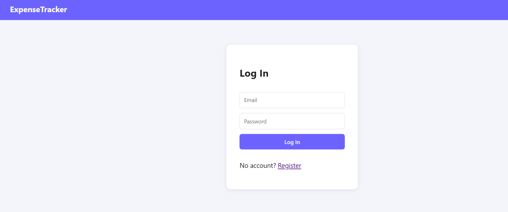
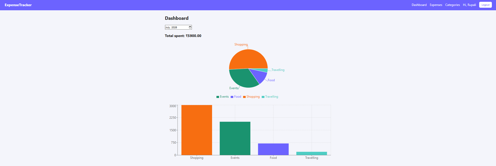
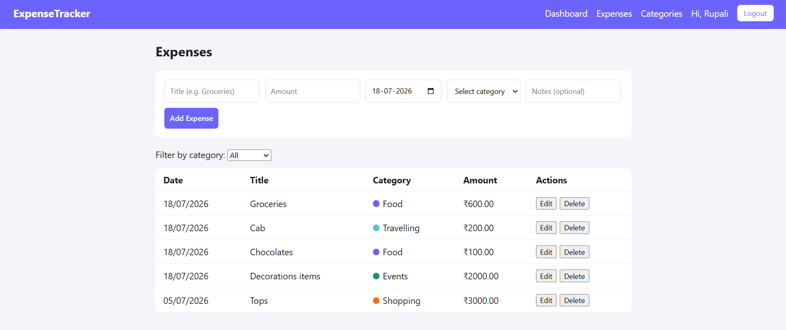
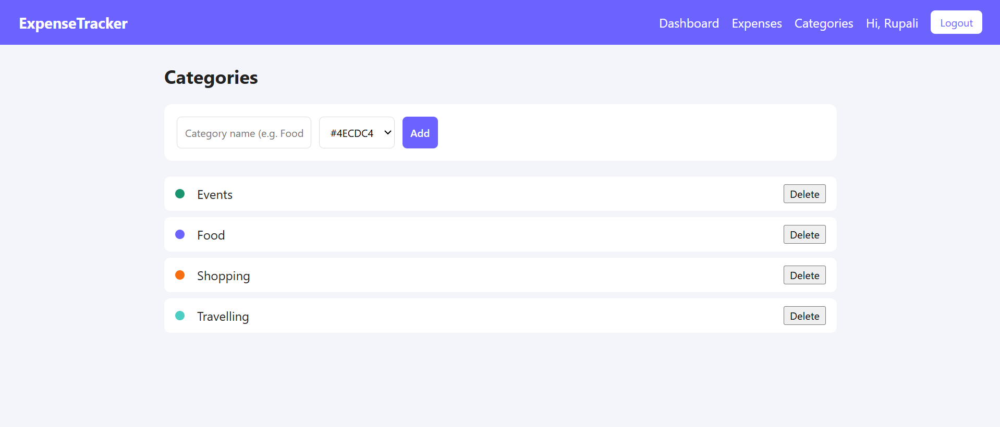

# 💰 Expense Tracker — MERN Stack

A full-stack expense tracking app with JWT authentication, custom categories,
and a visual analytics dashboard — built with MongoDB, Express, React, and Node.js.

🔗 **Live Demo**: https://expense-tracker-mern-teal.vercel.app(#)
---

## 📸 Screenshots

### Login & Register



### Dashboard — Monthly spend breakdown 


### Expenses — Add, filter, edit, delete


### Categories — Custom, color-coded


---

## ✨ Features

- 🔐 **Authentication** — Register/login with JWT, passwords hashed with bcrypt
- 🏷️ **Categories** — Create custom categories with color tags, scoped per user
- 💸 **Expenses** — Add, edit, delete, and filter expenses by category/date
- 📊 **Dashboard** — Monthly total spend with pie chart + bar chart breakdown by category (Recharts)
- 🔒 **Data isolation** — Every query is scoped to the logged-in user; no cross-user data leakage

---

## 🛠️ Tech Stack

| Layer | Tech |
|---|---|
| Frontend | React, React Router, Recharts, Axios |
| Backend | Node.js, Express |
| Database | MongoDB (Mongoose) |
| Auth | JWT, bcrypt |
| Deployment | Vercel (frontend), Railway (backend + MongoDB) |

---

## 📁 Project Structure

```
expense-tracker/
├── server/                 # Express + MongoDB API
│   ├── config/db.js
│   ├── models/              (User, Category, Expense)
│   ├── controllers/
│   ├── routes/
│   ├── middleware/authMiddleware.js
│   └── server.js
├── client/                 # React frontend
│   └── src/
│       ├── api/axios.js
│       ├── context/AuthContext.js
│       ├── components/       (Navbar, ExpenseForm, ExpenseList, ProtectedRoute)
│       └── pages/            (Login, Register, Dashboard, Expenses, Categories)
└── screenshots/
```

---

## 🚀 Running Locally

### Backend
```bash
cd server
npm install
cp .env.example .env   
npm run dev           
```

### Frontend
```bash
cd client
npm install
cp .env.example .env   
npm start              
```

---

## 📡 API Reference

| Method | Endpoint | Auth | Description |
|---|---|---|---|
| POST | `/api/auth/register` | ❌ | Create account |
| POST | `/api/auth/login` | ❌ | Log in, returns JWT |
| GET | `/api/auth/me` | ✅ | Get current user |
| GET | `/api/categories` | ✅ | List categories |
| POST | `/api/categories` | ✅ | Create category |
| PUT | `/api/categories/:id` | ✅ | Update category |
| DELETE | `/api/categories/:id` | ✅ | Delete category |
| GET | `/api/expenses` | ✅ | List expenses (supports `category`, `startDate`, `endDate`, `page` query params) |
| POST | `/api/expenses` | ✅ | Create expense |
| PUT | `/api/expenses/:id` | ✅ | Update expense |
| DELETE | `/api/expenses/:id` | ✅ | Delete expense |
| GET | `/api/expenses/summary?month=YYYY-MM` | ✅ | Category breakdown for dashboard charts |


---


## 🔮 Possible Extensions

- Recurring/scheduled expenses
- Budget limits per category with alerts
- CSV/PDF export of expense history
- Multi-currency support

---

## 👤 Author

Rupali R
